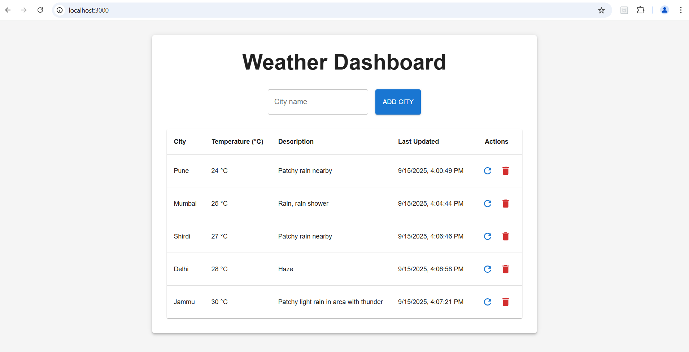

# A simple Weather App using [Spring boot](https://reactjs.org)

## Scripts

Install maven dependencies

#### `mvn clean install`

In the project directory, you can run:

#### `mvn spring-boot:run`

Runs the app using above command or any editor
Api are listening on (http://localhost:8080) to make API call from the browser.

